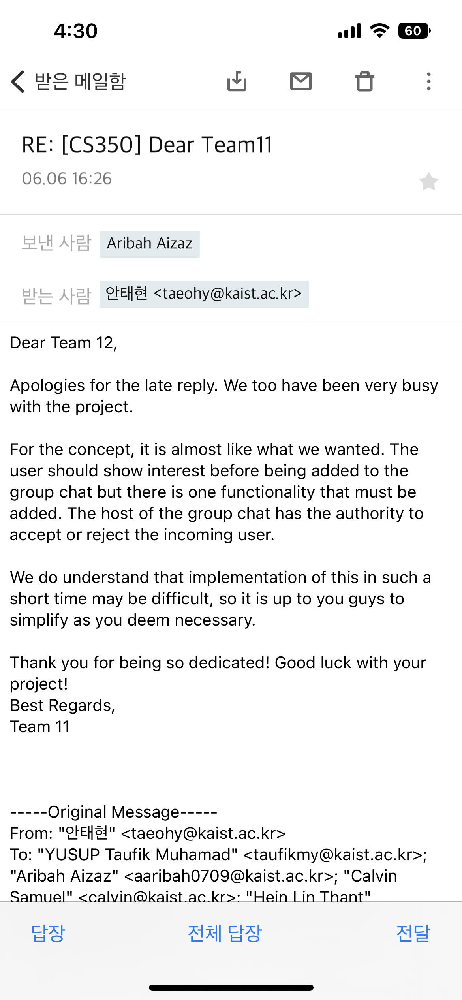

- [1. Introduction](#1-introduction)
- [2. Our Role as a Client](#2-our-role-as-a-client)
  - [2.1 Managing Project Versions and Expectations](#21-managing-project-versions-and-expectations)
    - [2.1.1 Problem](#211-problem)
    - [2.1.2 Solution: Enhanced Version Control for Documentation](#212-solution-enhanced-version-control-for-documentation)
  - [2.2 Differing Service Focus and User Flow](#22-differing-service-focus-and-user-flow)
    - [2.2.1 Problem](#221-problem)
    - [2.2.2 Solution: Comprehensive and Detailed Documentation](#222-solution-comprehensive-and-detailed-documentation)
  - [2.3 Discrepancies in UI Design and HCI](#23-discrepancies-in-ui-design-and-hci)
    - [2.3.1 Problem](#231-problem)
    - [2.3.2 Solution: Reference-Based UI Design](#232-solution-reference-based-ui-design)
- [3. Our Role as Developers](#3-our-role-as-developers)
  - [3.1 Product Specification](#31-product-specification)
    - [3.1.1 Communicating with the client and analyzing the SRS documentation](#311-communicating-with-the-client-and-analyzing-the-srs-documentation)
    - [3.1.2 Product requirements specification](#312-product-requirements-specification)
    - [3.1.3 Target platforms: iOS and Android](#313-target-platforms-ios-and-android)
    - [3.1.4 Deciding to use Firebase + Flutter for database and user registration functionality](#314-deciding-to-use-firebase--flutter-for-database-and-user-registration-functionality)
    - [3.1.5 Developing with Firebase Firestore and Storage](#315-developing-with-firebase-firestore-and-storage)
  - [3.2 Design Process](#32-design-process)
    - [3.2.1 Using Flutterflow, a no-code tool to streamline design work](#321-using-flutterflow-a-no-code-tool-to-streamline-design-work)
    - [3.2.2 Prototype development with Flutterflow](#322-prototype-development-with-flutterflow)
    - [3.2.3 Integrating Flutter design components into front-end development](#323-integrating-flutter-design-components-into-front-end-development)
  - [3.3 Project Management](#33-project-management)
    - [3.3.1 Consider Kanban and Scrum for project management](#331-consider-kanban-and-scrum-for-project-management)
    - [3.3.2 Adopting Kanban due to difficulties with strict iterations](#332-adopting-kanban-due-to-difficulties-with-strict-iterations)
    - [3.3.3 Setting Work-in-Progress limits for collaborative and fluid work](#333-setting-work-in-progress-limits-for-collaborative-and-fluid-work)
  - [3.4 Development Process](#34-development-process)
    - [3.4.1 Using GitHub-Flow, a simpler branching strategy than Git-Flow](#341-using-github-flow-a-simpler-branching-strategy-than-git-flow)
    - [3.4.2 Establish commit message guidelines](#342-establish-commit-message-guidelines)
    - [3.4.3 Collaborative development with GitHub-Flow](#343-collaborative-development-with-github-flow)
  - [3.5 CI/CD](#35-cicd)
    - [3.5.1 Implementing CI/CD with GitHub Actions](#351-implementing-cicd-with-github-actions)
    - [3.5.2 Ensure code review efficiency by ensuring adherence to the style guide and leaner](#352-ensure-code-review-efficiency-by-ensuring-adherence-to-the-style-guide-and-leaner)
- [4. Conclusion](#4-conclusion)
  - [4.1 Successful development of an app based on Flutter and Firebase](#41-successful-development-of-an-app-based-on-flutter-and-firebase)
  - [4.2 Summary of key achievements and challenges faced](#42-summary-of-key-achievements-and-challenges-faced)
  - [4.3 Lessons learned and recommendations for future projects](#43-lessons-learned-and-recommendations-for-future-projects)

# 1. Introduction

This report provides a comprehensive account of our experiences during a project in our introduction to software engineering course. Our dual roles offered us a unique perspective – as a client commissioning the project 'EveryDraw' and as a developer team responsible for executing the project 'HobbyHive'. In the process, we developed a keen understanding of the intricate dynamics between clients and software development teams.

As a collective comprised of members from Sparcs and GDSC, our team was blessed with the advantage of basic development experience. This allowed us to shift our focus towards implementing advanced software engineering techniques. Emphasizing project management, we incorporated Kanban boards for task tracking and established a robust Continuous Integration/Continuous Deployment (CI/CD) process for efficient software delivery.

During our stint as clients, we realized the pivotal role of documentation and its potential areas for improvement. The project exposed us to the importance of clear and comprehensive documentation. This report details the improvements we have identified and proposed, aiming to enhance future software development projects.

# 2. Our Role as a Client

In our introductory software engineering class, we played dual roles - one of which was as a client commissioning the development of 'EveryDraw'. EveryDraw was envisaged as a platform to facilitate fair prize drawings for sharing events held at KAIST. These events typically involve participants sharing certain posts on social media platforms, and EveryDraw was conceived as an impartial tool to handle these sweepstakes.

While the final outcome was substantially aligned with our expectations, there were certain gaps identified. Here, we discuss these discrepancies and provide our insights on the corresponding improvements needed.

## 2.1 Managing Project Versions and Expectations
### 2.1.1 Problem
We initiated the project with a grand vision, a fully fleshed-out version of EveryDraw. At the same time, we also outlined an MVP (Minimum Viable Product) that was realistically scoped given the constrained timeframe. This dual-track vision served as a roadmap for the development team. However, during the course of the project, some miscommunications surfaced, leading to deviations from our expectations, particularly in the login method implementation.

### 2.1.2 Solution: Enhanced Version Control for Documentation
Our experience underscored the importance of version control, not just for the codebase, but equally for the SRS (Software Requirements Specification) documentation. It is not unusual for a project's functionality to be scaled down or up depending on the timeline and other constraints. Therefore, keeping a meticulous record of what was altered, added, or removed becomes paramount to avoid confusion and ensure all stakeholders are on the same page. Implementing such version control measures for the documentation would significantly enhance the overall project management.

## 2.2 Differing Service Focus and User Flow
### 2.2.1 Problem
As we delved deeper into the development process, we noticed a slight disconnect in the focus areas. While our main concern was the fairness of the lottery system, the development team placed significant emphasis on event registration and management. These different focal points created minor discrepancies, particularly visible in the user interface (UI).

### 2.2.2 Solution: Comprehensive and Detailed Documentation
This realization brought to light the critical need for comprehensive and detailed documentation. During the meetings, certain contexts and conversations that we considered 'understood' were not explicitly included in the documentation, leading to differences in understanding. Documenting all aspects, even those that appear obvious or trivial, would ensure a shared understanding among all stakeholders, minimizing the chances of misinterpretation or overlooked details.

## 2.3 Discrepancies in UI Design and HCI
### 2.3.1 Problem
Our vision for the UI design was captured through wireframes that we provided for certain pages. The development team did a commendable job implementing these. However, for the pages not covered by the wireframes, the implemented design deviated from our original vision.

### 2.3.2 Solution: Reference-Based UI Design
This experience highlighted the usefulness of using other successful services as references for ensuring a user-friendly UI. Standard pages such as login and profile management are universally similar across various services. By citing these as references, we could provide explicit examples and concrete guidance to the development team. This would increase the likelihood of the final product accurately reflecting our intended design and user flow.

# 3. Our Role as Developers

As developers, our task was to bring to life the vision of a project named 'HobbyHive'. HobbyHive is a matchmaking service designed to help individuals find others who share their hobbies. The aim was to create a cohesive community where people could connect, engage, and share their interests.

In accordance with the requirements laid out by the client, we set out to develop HobbyHive as an application, choosing Flutter and Firebase as our primary technologies. Flutter, with its ability to create visually appealing UI and cross-platform compatibility, and Firebase, with its comprehensive suite of backend services, seemed like the perfect fit for our development needs.

## 3.1 Product Specification

### 3.1.1 Communicating with the client and analyzing the SRS documentation

In the early stages of the project, we worked with the client. We analyzed the SRS (Software Requirements Specification) document provided by the client and used it to refine the product specification. We regularly exchanged views via email and answered questions to clarify the product requirements.

### 3.1.2 Product requirements specification

To meet the client's expectations, we decided to develop an app that works on iOS and Android. For the app, we chose a combination of Firebase and Flutter for user data management, and used Firestore and Storage provided by Firebase to implement the database and signup features. This allowed us to build a stable and scalable app.

### 3.1.3 Target platforms: iOS and Android

Our team set up the app to be developed for both iOS and Android platforms. By doing so, we ensured that the app would be available to a wide range of users, even if they were using different operating systems. By utilizing Flutter's cross-platform development capabilities, we were able to easily deploy the app to multiple platforms.

### 3.1.4 Deciding to use Firebase + Flutter for database and user registration functionality

Among the client's requirements, we needed to implement a database and user registration functionality. For this, we decided to develop with a combination of Firebase and Flutter. Firebase is an easy-to-use and scalable cloud-based platform, which made it easy to implement database management and user authentication. The combination of Flutter and Firebase provided us with the functionality we wanted and an efficient development process.

### 3.1.5 Developing with Firebase Firestore and Storage

We implemented data management for the app using Firebase's database service, Firestore, and file storage, Storage. Firestore provides real-time data synchronization and scalability, and we were able to store and retrieve user data efficiently. Storage provided the ability to securely store and access user resources such as images and files. These features of Firebase allowed us to develop a reliable and flexible data management solution.

## 3.2 Design Process

### 3.2.1 Using Flutterflow, a no-code tool to streamline design work

Since we were a team of developers without a designer, we used a no-code tool called Flutterflow to streamline our design work. Flutterflow gives you the ability to configure the design of your app through a visual interface. This made it easy for developers without design expertise to place UI elements and organize the overall layout of the app.

### 3.2.2 Prototype development with Flutterflow

We used Flutterflow to prototype the app. Flutterflow provides the ability to visually assemble user interface elements to simulate the behavior and flow of the app. This allowed us to better communicate with the client, and we were able to quickly demonstrate early looks of the app and get feedback.

### 3.2.3 Integrating Flutter design components into front-end development

The design of the prototype created in Flutterflow was compatible with Flutter's design components, which made it easy for us to integrate the design components created in Flutterflow during the front-end development phase. By utilizing Flutter's various UI elements and design patterns, we were able to apply a consistent design to our app, and our developers were able to focus more on design work.

## 3.3 Project Management

### 3.3.1 Consider Kanban and Scrum for project management

Our team considered Kanban and Scrum to effectively manage our project. Kanban is a good way to visually track tasks and manage priorities, while Scrum is a project management method based on more rigorous iterations and planning. We wanted to compare the two methods and choose the one that best suited our team's style of working.

### 3.3.2 Adopting Kanban due to difficulties with strict iterations

We anticipated that our team would have difficulty following strict iteration due to the high variability of team members' work, so we adopted Kanban for project management to account for this difficulty. Kanban was better suited to our team's collaborative work, as it is a fluid way of managing tasks as flows, with the flexibility to add or remove tasks as needed.

### 3.3.3 Setting Work-in-Progress limits for collaborative and fluid work

To keep our work collaborative and flexible, we set Work-in-Progress (WIP) limits. By limiting the number of tasks that can be in progress at one time, WIP limits create an environment where team members can stay focused and complete their work. This allowed us to maintain efficient collaboration and clearly prioritize tasks.

## 3.4 Development Process

### 3.4.1 Using GitHub-Flow, a simpler branching strategy than Git-Flow

During the development of our project, our team used GitHub-Flow, a simpler and more flexible branching strategy than Git-Flow. GitHub-Flow is organized into main and protected branches, and tasks such as feature development or bug fixes are performed in each branch. This approach provided developers with a free flow of work while ensuring the stability of the code.

### 3.4.2 Establish commit message guidelines

To ensure efficient collaboration and streamline code review processes, our team implemented commit message guidelines. These guidelines played a crucial role in maintaining clear communication among team members and facilitating a comprehensive understanding of code changes.

For branch naming, we followed the convention of {feature|main}/[pages|logic]/[feature_name]. This convention helped us organize our branches effectively, making it easier to identify and locate specific features or sections of the codebase. An example of a branch name would be "feature/pages/sign_in_page."

In terms of commit messages, we established a structured format: {Type}: {Description}. The Type represented the nature of the commit, such as Design, Add, Delete, Fix, and more. By categorizing our commit messages, we were able to quickly grasp the purpose of each change. For instance, a commit message could be "Design: Implemented sign-in page."

Adhering to these commit message guidelines proved highly beneficial. They enhanced our ability to track modifications, understand the context of changes, and conduct efficient code reviews. The clarity and conciseness of the commit messages ensured effective collaboration throughout the development process.

### 3.4.3 Collaborative development with GitHub-Flow

Our team utilized GitHub-Flow for collaborative development. Each feature or task that needed to be fixed was developed in a separate branch, and once the task was completed, that branch was merged into the main branch. This allowed multiple developers to work simultaneously and ensured efficient development while maintaining consistency and stability of the code.

## 3.5 CI/CD

### 3.5.1 Implementing CI/CD with GitHub Actions

Our team utilized GitHub Actions for continuous integration and deployment. GitHub Actions are used to automate the development process by automatically performing tasks such as build, test, and deploy whenever a source code change occurs. We set up a GitHub Actions workflow by defining the build, test, and required deployment steps for our app. This allowed us to automatically go through the development process whenever there was a code change and maintain a stable app.

### 3.5.2 Ensure code review efficiency by ensuring adherence to the style guide and leaner

Our team adopted a style guide and a linter to maintain consistency and quality in our code. Developers wrote code according to the style guide, and the linter detected potential errors or anti-patterns in the code. GitHub Actions automatically checked code for compliance with the requirements of the style guide and leaner, which increased efficiency in the code review process. Developers could see the results of the style guide and leaner's checks when reviewing code changes, making their feedback more focused.

# 4. Conclusion

## 4.1 Successful development of an app based on Flutter and Firebase

Our team successfully developed an app based on Flutter and Firebase. We created a multi-platform app that met the client's needs and effectively utilized Firebase's Firestore and Storage to support the database and signup features. We achieved the goals of the app in terms of functionality and user experience, and achieved a successful outcome through good communication and collaboration with the client.

## 4.2 Summary of key achievements and challenges faced

During the course of the project, our key achievements were: 1) We refined the product specification through email communication with the client and developed an app that met the client's expectations; 2) We utilized Flutterflow to streamline design work in the absence of a designer and built prototypes quickly; 3) We adopted Kanban for project management and set Work-in-Progress limits to ensure collaborative and fluid work.

But they also faced some challenges. We chose Kanban because it was difficult to apply strict iterations, and project management needed to be coordinated in the beginning. We also faced some challenges in front-end development due to the absence of a designer. To overcome these challenges, team members actively communicated and worked together to solve problems.

## 4.3 Lessons learned and recommendations for future projects

Our team learned several lessons from this project. First, we realized the importance of clear communication and requirements analysis with the client at the beginning of the project. Second, we found it effective to leverage the no-code tool Flutterflow during the design phase to quickly develop prototypes. Third, we learned that applying Kanban and Work-in-Progress limits for efficient project management can increase collaboration and flexibility.

We make several recommendations for future projects. First, it is important to clearly define project goals and requirements early on and maintain good communication with the client. Second, we recommend utilizing no-code tools or prototyping tools to streamline design efforts. Third, you should choose an appropriate methodology for project management and explore ways to flexibly organize your workflow.