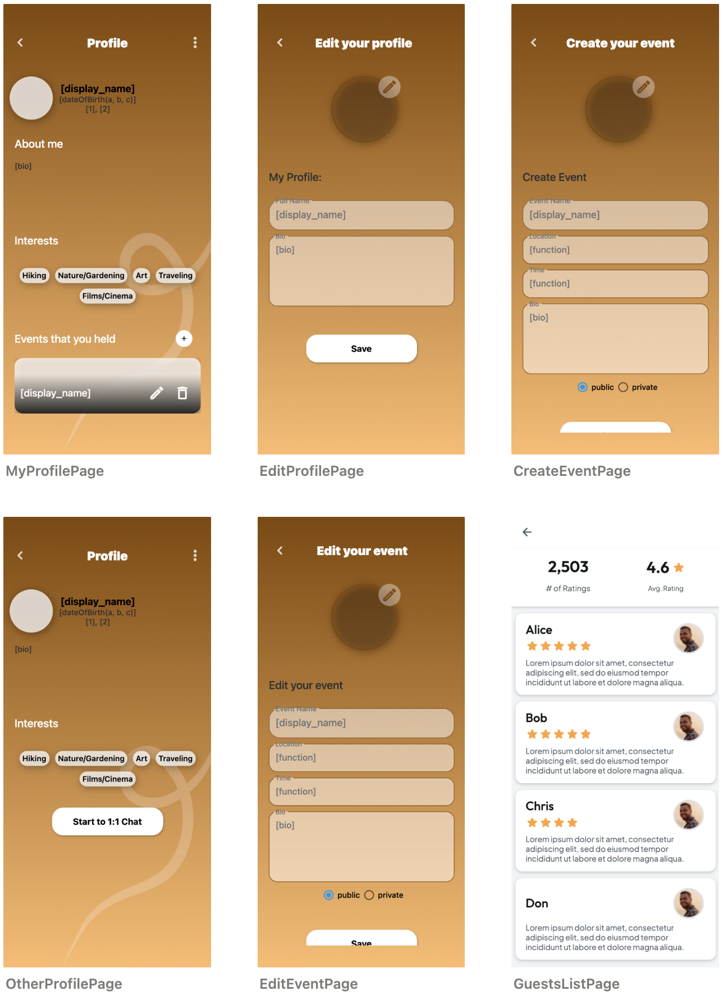
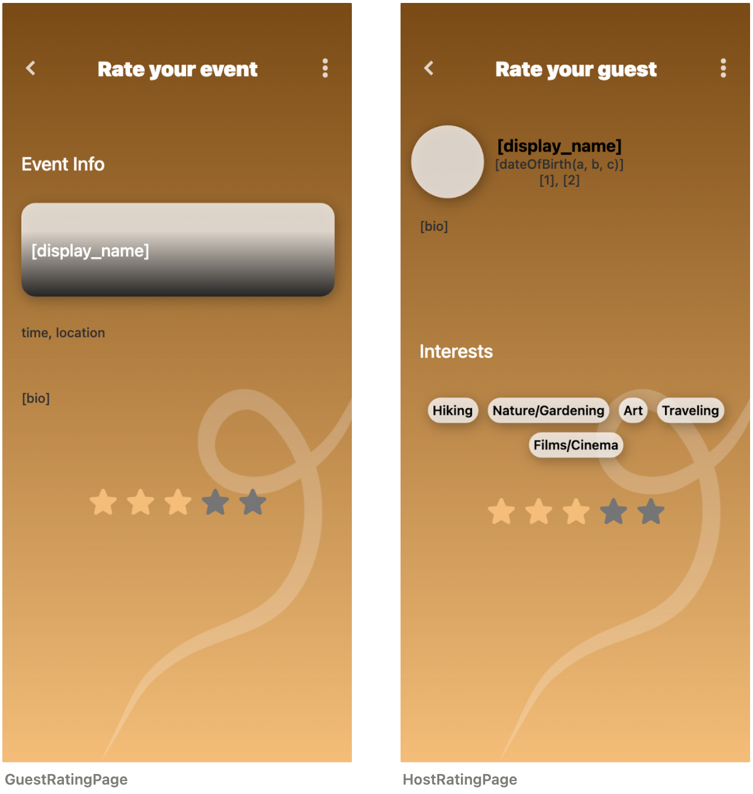

# Software Design Document

## Table of Contents
- [Software Design Document](#software-design-document)
  - [Table of Contents](#table-of-contents)
  - [Introduction](#introduction)
  - [Overview](#overview)
  - [Architectural Design](#architectural-design)
    - [Class Diagram](#class-diagram)
    - [Main components](#main-components)
      - [Client-side Application](#client-side-application)
      - [Server-side Application](#server-side-application)
      - [Firebase](#firebase)
    - [Design Patterns](#design-patterns)
      - [Model-View-ViewModel (MVVM)](#model-view-viewmodel-mvvm)
      - [Repository Pattern](#repository-pattern)
      - [Dependency Injection](#dependency-injection)
      - [Observer Pattern](#observer-pattern)
      - [Singleton Pattern](#singleton-pattern)
      - [Factory Method Pattern](#factory-method-pattern)
  - [Data Design](#data-design)
    - [ER Model](#er-model)
      - [Entities](#entities)
        - [Events](#events)
        - [Users](#users)
        - [Chatrooms](#chatrooms)
        - [Message](#message)
        - [Contents](#contents)
        - [Requests](#requests)
        - [Interests](#interests)
      - [Relations](#relations)
    - [Concretized data model for firebase(NoSQL)](#concretized-data-model-for-firebasenosql)
      - [Event document](#event-document)
      - [User document](#user-document)
      - [Chatroom and message document](#chatroom-and-message-document)
      - [Interest](#interest)
      - [Request](#request)
      - [Overall structure](#overall-structure)
      - [Constraints](#constraints)
  - [Procedure Design](#procedure-design)
    - [Use Case](#use-case)
      - [Event Use Case](#event-use-case)
      - [User Use Case](#user-use-case)
    - [Sign Up and New Profile Set Up Sequences](#sign-up-and-new-profile-set-up-sequences)
      - [Description](#description)
      - [Sequences](#sequences)
      - [Requirements](#requirements)
    - [Sign in Sequences](#sign-in-sequences)
      - [Description](#description-1)
      - [Sequences](#sequences-1)
    - [Retrieve Password Sequences](#retrieve-password-sequences)
      - [Description](#description-2)
      - [Sequences](#sequences-2)
      - [Requirements](#requirements-1)
    - [Create and Join Event](#create-and-join-event)
      - [Description](#description-3)
      - [Requirements](#requirements-2)
    - [Chat sequences](#chat-sequences)
      - [Description](#description-4)
      - [Requirements](#requirements-3)
  - [Interface Design](#interface-design)
    - [Auth](#auth)
    - [Bottom Navigation (as a component)](#bottom-navigation-as-a-component)
    - [User Profile Input](#user-profile-input)
    - [State](#state)
    - [Profile and Event Managing](#profile-and-event-managing)
    - [Settings](#settings)
    - [Chat](#chat)
    - [Notifications](#notifications)
    - [Rating](#rating)


## Introduction

HobbyHive is a mobile application that provides a safe environment for people to explore new hobbies and connect with others who share their interests. The app allows users to set up meeting times or join groups of like-minded individuals who are interested in the same hobbies.

HobbyHive offers fully customizable user experiences, including distance filters, personalized tags, individual ratings, and a familiar interface of swiping left and right. The app is designed to be easy to use and intuitive, making it accessible to users of all ages and skill levels.

Some of the key features of HobbyHive include sign up, new profile set up, password retrieval, search bar, arranging an event, chatting among users, and a rating system. These features are described in detail in the Software Requirements Specification (SRS) document and are implemented according to the design outlined in the Software Design Document (SDD).

Overall, HobbyHive is designed to help people explore new hobbies and connect with others who share their interests. By providing a safe and welcoming environment for hobbyists of all kinds, HobbyHive aims to help people expand their horizons and discover new passions.

## Overview


## Architectural Design

### Class Diagram


### Main components

HobbyHive is a mobile application developed using the Flutter framework and Firebase cloud platform. The system architecture consists of three main components: the client-side application, the server-side application, and the Firebase database.

#### Client-side Application

Client-Side Application: We will use Flutter, a mobile app development framework, to build the client-side application. Flutter allows us to create high-performance, cross-platform apps for both iOS and Android using a single codebase. The client-side application will communicate with the server-side application and Firebase using HTTP/2 and HTTPS protocols.

1. User Authentication: The client-side application will allow users to sign up and log in using email/password, Google, Facebook, or other third-party providers. Once authenticated, users will be able to create and join events.
2. New Profile Setup: After signing up, users will be prompted to set up their profile by providing their name, profile picture, bio, and interests/hobbies.
3. Retrieve Password: The client-side application will allow users to retrieve their password if they forget it by sending a password reset link to their registered email address.
4. Search Bar: The client-side application will allow users to search for events or other users using keywords or filters such as date/time, location, activity type, etc.
5. Event Creation: The client-side application will allow users to create new events by specifying the event name, date/time, location (including map integration), description, activity type (e.g., hiking), and any associated media files (e.g., images). Users will also be able to specify the maximum number of attendees for each event and set privacy settings such as approval of incoming members.
6. Event Discovery: The client-side application will allow users to discover nearby events based on their current location or search for events by keyword or category. Users will be able to view event details such as the event name, date/time, location (including map integration), description, activity type (e.g., hiking), and any associated media files.
7. Event Management: The client-side application will allow users to manage their own events by editing or deleting them as needed. Users will also be able to view a list of attendees for each event and remove attendees if necessary.
8. Chat Messaging: The client-side application will allow users to communicate with each other using a chat messaging system associated with each event. Users will be able to send text messages and share media files (e.g., images) within the chat messaging system.
9. Rating System: The client-side application will allow users to rate events and other users based on their experience. Users will be able to rate events on a scale of 1-5 stars and leave comments, as well as rate other users based on their behavior during the event.

#### Server-side Application

We will use Google Cloud Functions, a serverless compute platform, to build the server-side application. Cloud Functions allows us to write small pieces of code that can be triggered by events such as HTTP requests or changes in Firebase data. The server-side application will communicate with the client-side application and Firebase using HTTP/2 and HTTPS protocols.

1. Event scheduling: Cloud Functions can be used to schedule events at specific times or intervals. This feature will be used to automatically close events after they have ended.
2. Geolocation: Cloud Functions can be used to perform geolocation-based queries on the real-time database. This feature will be used to find nearby events based on the user's location.
3. Image processing: Cloud Functions can be used to process images uploaded by users before storing them in cloud storage. This feature will ensure that images are properly formatted and optimized for display on different devices.
4. Data validation: Cloud Functions can be used to validate data before it is stored in the real-time database or cloud storage. This feature will ensure that only valid data is stored in the system.

#### Firebase

We will use Firebase as our backend infrastructure for data storage, authentication, and messaging. Firebase provides a suite of tools that make it easy to build scalable apps without managing servers or infrastructure. The client-side and server-side applications will communicate with Firebase using the Firebase SDKs, which provide APIs for accessing data in real-time.

1. Real-time database: Firebase provides a real-time database that can be used to store and synchronize data across multiple clients in real-time. This feature will be used to store user data, event data, and chat messages.
2. Authentication: Firebase provides authentication services that can be used to authenticate users using email/password, Google, Facebook, or other third-party providers.
3. Cloud Messaging: Firebase provides cloud messaging services that can be used to send push notifications to users when new events are created or when existing events are updated.
4. Storage: Firebase provides cloud storage services that can be used to store images and other media files associated with events.

In terms of protocols used for communication between these components:

1. HTTP/2: This is a protocol used for communication between the client-side and server-side applications as well as between the server-side application and Firebase. HTTP/2 is an optimized version of HTTP that reduces latency by allowing multiple requests/responses to be sent over a single connection.
2. HTTPS: This is a protocol used for secure communication between the client-side and server-side applications as well as between the server-side application and Firebase. HTTPS encrypts all data sent over the network to prevent eavesdropping or tampering.
3. Real-time Database Protocol: This is a protocol used by Firebase's real-time database service to synchronize data in real-time between clients and servers. The protocol uses WebSockets to establish a persistent connection between clients and servers, allowing data to be pushed to clients in real-time.
4. Firebase Cloud Messaging Protocol: This is a protocol used by Firebase's cloud messaging service to send push notifications to clients. The protocol uses HTTP/2 to send messages from the server-side application to Firebase, which then delivers the messages to clients using platform-specific protocols such as APNs (Apple Push Notification Service) or FCM (Firebase Cloud Messaging).

### Design Patterns

To ensure scalability and maintainability of HobbyHive's architecture, we will use several design patterns:

#### Model-View-ViewModel (MVVM)

In MVVM, the Model represents the data and business logic of the application, the View represents the user interface, and the ViewModel acts as an intermediary between the Model and View. The ViewModel exposes data from the Model to the View in a way that is easy to bind to, and it also handles user input from the View and updates the Model accordingly.

To implement MVVM in HobbyHive, we can use Flutter's built-in support for reactive programming with streams and observables. We can create a separate ViewModel class for each screen in our app, which will handle all of the business logic for that screen. The ViewModel will expose streams of data to the View, which can be easily bound to using Flutter's StreamBuilder widget.

For example, let's say we have a screen that displays a list of events. We would create an EventListViewModel class that would handle fetching event data from Firebase and exposing it as a stream to our EventListScreen. The EventListScreen would then use a StreamBuilder widget to listen to changes in this stream and update its UI accordingly.

The MVVM pattern provides several benefits, including:

1. Separation of Concerns: MVVM separates the concerns of data, business logic, and user interface into separate components. This makes it easier to maintain and modify each component independently without affecting the others.
2. Testability: Because the ViewModel is responsible for all of the business logic in MVVM, it can be easily tested in isolation from the View and Model. This makes it easier to write unit tests for our application's business logic.
3. Reusability: By separating our application's components into distinct layers, we can reuse them more easily across different screens or even different applications.
4. Scalability: As our application grows in complexity, MVVM makes it easier to manage that complexity by keeping each component focused on its specific responsibilities.
5. Improved User Experience: By using reactive programming with streams and observables, MVVM can provide a more responsive user experience by updating the UI automatically as data changes.

#### Repository Pattern

The Repository Pattern is a design pattern that abstracts data access by providing an interface between data sources (Firebase database) and business logic. In HobbyHive's architecture, we will use repositories to encapsulate data access logic and provide a consistent interface for accessing data.

The Repository Pattern provides several benefits, including:

1. Separation of concerns - By separating data access logic from business logic, it becomes easier to maintain and modify each component independently.
2. Testability - Repositories can be tested independently of other components in the system.
3. Flexibility - Repositories can be easily swapped out with other implementations without affecting other parts of the system.

#### Dependency Injection

Dependency Injection is a design pattern that allows for the decoupling of components by providing a mechanism for injecting dependencies into objects. In HobbyHive's architecture, we will use dependency injection to provide components with the dependencies they need to function.

The Dependency Injection pattern provides several benefits, including:

1. Decoupling of components - By providing dependencies through injection, components become less tightly coupled, making it easier to modify and maintain them.
2. Testability - Components can be tested independently of their dependencies by providing mock objects during testing.
3. Flexibility - Dependencies can be easily swapped out with other implementations without affecting other parts of the system.

#### Observer Pattern

The Observer Pattern is a design pattern that allows objects to subscribe to events and receive notifications when those events occur. In HobbyHive's architecture, we could use the Observer Pattern to notify users when new events are created or when existing events are updated.

#### Singleton Pattern

The Singleton Pattern is a design pattern that ensures that only one instance of a class exists in the system. In HobbyHive's architecture, we could use the Singleton Pattern to ensure that only one instance of the Firebase database connection exists.

#### Factory Method Pattern

The Factory Method Pattern is a design pattern that provides an interface for creating objects but allows subclasses to decide which class to instantiate. In HobbyHive's architecture, we could use the Factory Method Pattern to create different types of events based on user input.

## Data Design

### ER Model


#### Entities

There are 7 entities for the system: events, users, chatrooms, messages, contents, requests, interests. Following table describe each attributes of entity.

##### Events

| Attribute name | Type | Description |
| --- | --- | --- |
| id | integer | The primary key of the event entity |
| event_name | string | The name of the event |
| host_id | integer | The id of host hosting the event |
| participant_id | array | The id of participants participating the event |
| event_image | reference | The background image of the event |
| address | string | The place holding the event |
| latitude | float | Latitude of the place holding the event |
| longitude | float | Longtitude of the place holding the event |
| interest_id | int | The id of the area of interest that the event targets |
| day | datetime | Date and time the event starts |
| description | string | Short description about the event |
| is_private | boolean | Whether it is a private event |

##### Users

| Attribute name | Type | Description |
| --- | --- | --- |
| id | integer | The primary key of the user entity |
| user_name | string | The displayed name of the user |
| email | string | The email of the user |
| age | integer | The age of the user |
| profile_image | reference | The profile image of the user |
| biographie | string | The biographie of the user |
| interest_id | array | The id of the area of interest that the user interested in |
| chatroom_id | array | The id of the chatroom that the user is participating |
| host_score | float | The score of the user as a host |
| participant_score | float | The score of the user as a participant |

##### Chatrooms

| Attribute name | Type | Description |
| --- | --- | --- |
| id | integer | The primary key of the chatroom entity |
| room_name | string | The name of the chat room |
| room_photo | reference | The profile photo of the chat room |
| messages | array | The messages in the chat room |
| user_id | array | The users participating in the chat room |

##### Message

| Attribute name | Type | Description |
| --- | --- | --- |
| id | integer | The primary key of the message entity |
| sender_id | integer | The id of sent the message |
| content | map | The profile photo of the chat room |
| sent_time | timestamp | Time the message was sent |

##### Contents

| Attribute name | Type | Description |
| --- | --- | --- |
| id | integer | The primary key of the content entity |
| text | string | Text content |
| image | reference | Image content |
| video | reference | Video content |

##### Requests

| Attribute name | Type | Description |
| --- | --- | --- |
| id | integer | The primary key of the request entity |
| event_id | integer | The id of the event to join |
| participant_id | integer | The id of the user to participate |

##### Interests

| Attribute name | Type | Description |
| --- | --- | --- |
| id | integer | The primary key of the message entity |
| name | string | The id of sent the message |

#### Relations

| Attribute1 | Attribute2 | Mapping cardinality | Description |
| --- | --- | --- | --- |
| events.host_id | users.id | 1:1 | Host |
| events.participants_id | users.id | 1:M | Participants |
| interests.id | events.ineterest_id | 1:M | Event’s interest area |
| chatrooms.messages | messages.id | 1:M | Messages in chat room |
| chatrooms.users | users.id | 1:M | Users particiapting in the room |
| messages.sender_id | users.id | 1:1 | User who sent the message |
| messages.content | contents.id | 1:1 | The content of the message |
| users.interest_id | interests.id | 1:M | The interests of the user |

### Concretized data model for firebase(NoSQL)

#### Event document

```json
event {
	id: integer [PK]
  event_name: string
  host_id: integer
  participants_id: array<integer>
	event_image: reference
  address: string
  latitude: float
  longitude: float
  interest_id: integer
  day: datetime
  description: string
  is_private: boolean
}
```

#### User document

```json
user {
  id: integer [PK]
  user_name: string
  email: string
  age: integer
  profile_image: reference
  biographie: string
  interest_id: array<integer>
  host_score: float
  participant_score: float
	hosting_events: array<map{id: integer, event_name: string}>
	participating_events: array<map{id: integer, event_name: string}>
	participating_chatrooms: array{map<id: integer, room_name: string}>
}
```

#### Chatroom and message document

message is subcollection of the chatrooms

```json
chatroom {
  id integer: [primary key]
  room_name: string
  room_photo: reference
  user_id: array<integer>
	messages: collection
}

message {
	id: integer [primary key]
  sender_id: integer
  content: map{text: string, image: reference, video: reference}
	sent_time: timestampㄹㄹ
}
```

#### Interest

```json
interest {
  id: integer [primary key]
  name: string
}
```

#### Request

```json
request {
  id integer: [primary key]
  event_id: integer
  participant_id: integer
	participant_name: string
	participant_profile_image: reference
	participant_interests: array<integer>
	participant_biographie: string
	participant_score: float
}
```

#### Overall structure

```json
-- events collection
 |
 |--- event document1
 |
 |--- event document2
 |
 |--- ...

-- users collection
 |
 |--- user document1
 |
 |--- user document2
 |
 |--- ...

-- chatrooms collection
 |
 |--- chatroom document1
 |      |-- messages collection
 |        |
 |        |-- message document1
 |        |-- message document2
 |        |-- ...
 |--- chatroom document2
 |      |-- messages collection
 |        |
 |        |-- message document1
 |        |-- message document2
 |        |-- ...
 |--- ...

-- interests collection
 |
 |--- interest document1
 |
 |--- interest document2
 |
 |--- ...

-- requests collection
 |
 |--- request document1
 |
 |--- request document2
 |
 |--- ...

```

#### Constraints

Here, we try to clarify the constraints for attributes that did not appear in the previous er data model. These attributes are introduced for reduce the joins and faster queries.

1. hosting_events, participating_events, and participating_chatrooms in the user document should satisfy the referential constraint. Each id and name must keep consistent with event documents and chatroom documents
2. participant_name, participant_profile_image, participant_interests, participant_biographie, and participant_score in request doesn’t need to keep consistency. If the cost of maintaining consistency is too high, it is okay to keep the information when the corresponding document is added.

## Procedure Design

### Use Case

#### Event Use Case


HobbyHive is designed specifically for greater convenience in arranging hangouts and meeting up with new people that shares their absolute passion – dedicated to android, this mobile application targets outgoing individuals who might find it difficult to search for people that have the same interest or for those who just want to be the life of the party. Inspired by major dating apps like tinder, HobbyHive combines its integrative architecture into a platonic and interactive building block – focused entirely on meeting people alike. The first of its generation, HobbyHive creates a safe environment where people have the opportunity to look at the windows outside their world a bit further – no other than by setting up meeting times or joining other thrill-seeking groups. Fully flexible customization for user experience, with distance filters, personalized tags, individual ratings, and a familiar interface of swiping left and right – HobbyHive offers something not so foreign that we never knew we needed so much in our life.

HobbyHive’s workflow is similar to a mixture of classic social media and dating websites – the users will be registered through their individualized accounts, created using their email or phone number. HobbyHive’s design offers multiple opportunities for both sides of the people – whether you are starting up an invitation or looking to join new ones.

Participants could be outgoing people who love to try their hobbies but lack the friends or simply the resources to do so. They could also be people looking to try a new circle of things or meet up with new faces.

The users need not specify whether they want to be the host or participants at the moment they
sign up keep in mind that these functions are exclusive to the entity based on their intentions only and one may be a host or participants at any time – even a host can perform participant
functions. 			

#### User Use Case


### Sign Up and New Profile Set Up Sequences


#### Description

The user will sign up to HobbyHive and make a profile for themselves. Since this is a very basic feature of any user-centric platform, it is of high priority. Users will also be able to register themselves with other accounts such as Google or Facebook. The option to register with an email, in the case of no other account, will also be possible. Users will also select a method of password retrieval. The user will get to set up their profile, by entering their display name, age, picking their interests, etc. 

#### Sequences

Upon downloading the app for the first time, the screen will display email and password
fields, to register oneself. Beneath this will be buttons to sync one’s Google or
Facebook accounts.

1. When either field is tapped, the user’s keyboard will pop up.
2. To proceed to the next page, the email field must have a valid email address. And the password field must have at least 8 characters, out of which some must be English letters, special characters (! @#$%^&*), and numbers.
3. Once the information in the correct format is written, beneath the fields will appear the ‘Next’ button, which will take the user to the next page.
4. When the account is registered, the following procedures will take place to learn about the
user and give suggestions of meet-ups according to their interests, location, age, etc.
5. When the ‘Next’ button is tapped, a screen that will take permission to access the user’s location, contacts and photos will show up.
6. After that, the user will be asked for their display name, to upload a profile picture,
and to select their interests.
7. This information will be used to search for specially-catered meet-ups that the user
may enjoy, and these will be then suggested to the user.

#### Requirements

1.  Record the user’s email address and password.
2.  Indicate to the user, while typing and not after the “Next” button has been tapped, that there is an invalid input when the format of the inputted email does not match that of a standard email, and when there are illegal characters being used in the inputted password.

3.  Record the age, display name, and interest information of the user.
4.  Using the records, suggest upcoming events near them that fit their interests and for which they fit the age requirement.
5.  Out of the suggested events they select, record and update the priority of their interests.

### Sign in Sequences


#### Description

SignIn process with Firebase

#### Sequences

1. The user will enter the information required to sign on the SignInPage
2. It will be validated to match the user's information in Firebase.
3. If it is validated, it will proceed to the MainPage.

### Retrieve Password Sequences


#### Description

Resetting passwords using Firebase's own functionality (sending password reset emails)

#### Sequences

1. Enter your email address and press the reset button.
2. The user will receive an email to their email address to reset their password.

#### Requirements

1. Update the new password of the user.

### Create and Join Event


#### Description

This will allow users to create and arrange an event by being able to edit it, delete it, set its level of privacy, accept or reject users from it, invite users, remove users, remind the users and once it is over, mark it as completed.

Users as guests can join already created events that match their interests and are happening nearby. The user can view event details and interact with other participants.

#### Requirements

1. Record the settings of the event, such as the privacy status, the number of 
participants, etc.
2. Control which users have access to the event’s details.
3. Send a notification to the participants when the event is near.
4. Provide essential event details( name, date, time, location, and brief
description) in the event list.
5. Display event information on the event details page, including host’s
profile, detailed description, and list of attendees.
6. Add users to the events when they tap the 'Join' button and add them to the 
chat room.

### Chat sequences


#### Description

Sends the user's typed message to Firebase. Send a notification when Firebase recognizes that the database has changed, and fetch the chat data again.

#### Requirements

1. Create chats for users to exchange text messages, images, videos, and GIFs.
2. Give the host access to settings unavailable to the other participants.

## Interface Design

### Auth


- **SignInPage**
    - A page where users can sign in with their account information or with their Apple, Google, or Facebook account.
    - If user is new to this app, they can register.
    - If user forgot password, they can click “forgot password” and request mail to reset password.
    - User can also change app’s language.
- **PhoneSignInPage**: A page where users can sign in using their phone number.
- **SignUpPage**: A page where new users can create an account or sign up with their Apple, Google, or Facebook account. User can register by either email or telephone number.
- **PhoneVerificationSignUpPage**: A page where users can verify their phone number during the signup process.
- **EmailVerificationPage**: A page where users can verify their email address.
- **PhoneVerificationSignInPage**: A page where users can verify their phone number during the sign-in process.
- **PasswordResetPage**: A page where users can reset their password if they forgot it.

### Bottom Navigation (as a component)

- The app includes a bottom navigation component that allows users to easily navigate between the following pages: **MainPage**, **AllChatPage**, **EventsPage**, and **MyProfilePage**.

### User Profile Input


- **SelectLocationPage**: A page where users can select their location for events and other features in the app.
- **SetPhotoProfilePage**: A page where users can set or change their profile picture.
- **SetBaseInfoPage**: A page where users can set or change their basic information. There are display name, age, and interest information.


### State


- **IsJoinedPage**: A page that confirms the user has joined an event. User can start a conversation directly, or just check and leave the page.
- **EventsPage**: A page that shows a list of events for the user to select from. When the user clicks on an event, they are taken to the **GuestRatingPage** for that particular event.
- **MainPage**
    - The main page of the app that shows suggested events and other features.
    - User can search events on the search bar located top of the screen.
    - User can like or dislike for the suggested event.

### Profile and Event Managing



- **MyProfilePage**
    - A page that displays the user's profile information, including events they have hosted. If the user clicks on an event they hosted, they are taken to the **GuestsListPage** for that particular event.
    - There are user’s display name, bio, interests, and event that user held before.
- **EditProfilePage**: A page where users can edit their profile information.
- **CreateEventPage**: A page where hosts can create a new event. You can select whether it is public or private.
- **OtherProfilePage**: A page that displays the profile information of another user. The information is same to **MyProfilePage**, but there are “Start to 1:1 Chat” button that user can start personal chatting.
- **EditEventPage**: A page where hosts can edit their created event.
- **GuestsListPage**: A page that displays the list of guests attending a particular event. If the user clicks on a guest, they are taken to the **HostRatingPage** for that particular guest.

### Settings


- **SettingsPage**: A page where users can manage their app settings, such as notification preferences and language.  

### Chat


- **ChatPage**: A page where users can chat with each other one-on-one about a specific event.
- **AllChatPage**: A page that shows all chat conversations the user has had with other users.

### Notifications


- **NotificationsPage**: A page that displays all the notifications the user has received.
    

### Rating



- **GuestRatingPage**: A page where guests can rate their experience at a particular event.
- **HostRatingPage**: A page where hosts can rate their experience with a particular guest who attended their event.
